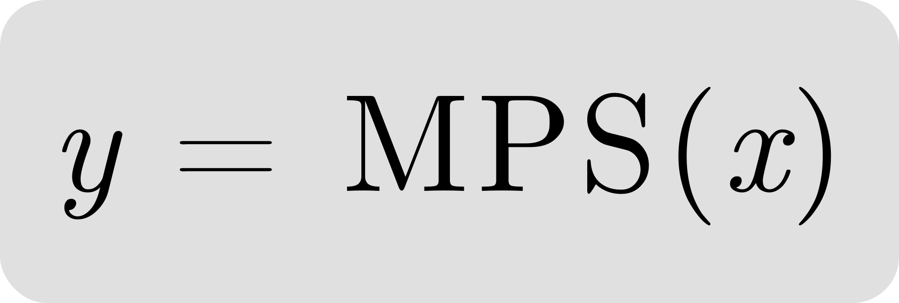

# GPU tensor framework with support for running ONNX models



MPSX is a general purpose GPU tensor framework written in Swift and based on MPSGraph. It provides a high-level API for performing efficient tensor operations on GPU, making it suitable for machine learning and other numerical computing tasks. MPSX also has the capability to run ONNX models out of the box, making it easy to integrate with existing machine learning pipelines.

## Features

1) GPU acceleration using Metal Performance Shaders (MPS) for efficient numerical computations
2) Support for commonly used tensor operations such as element-wise operations, convolution, pooling, and more
3) Support for running ONNX models out of the box, allowing for easy integration with existing models
4) Easy-to-use API for building and running graph-based computations

## Usage

It's important to note that while MPSX provides a more convenient API for building graph-based computations, users should still be familiar with common tensor rules and concepts. These rules include broadcasting, tensor shapes, data types, etc.

In addition to being familiar with common tensor rules and concepts, users of MPSX should also have some familiarity with the Metal API. This is because MPSX is built on top of the Metal framework, which provides low-level access to GPU hardware.

While MPSX abstracts away many of the details of working with Metal, users may still need to understand certain Metal concepts such as command buffers and textures in order to use MPSX effectively.

# DSL

MPSX provides a convenient DSL (Domain Specific Language) over MPSGraph to simplify the process of building graph-based computations. This DSL allows users to express computations in a more intuitive way, using operators such as + and - instead of the more verbose MPSGraph API.

For example, instead of writing:

``` swift
let z = graph.multiplication(
    graph.addition(x, y, name: nil),
    graph.constant(2, dataType: x.dataType),
    name: nil
)
```

Users can write:

``` swift
let z = (x + y) * 2
```

# ONNX

The subset of ONNX operators supported by MPSX is primarily focused on computer vision models.

However, MPSX is designed to be extensible and can be easily extended to support additional ONNX operators. If you need to add support for a specific operator, you can consider contributing to the MPSX project or implementing the functionality yourself.

The full list of ONNX operators currently supported by MPSX can be found in the [Onnx.swift](/Sources/MPSX/ONNX/Nodes/Onnx.swift) file in the MPSX source code. This file contains the definitions for all supported ONNX operators and their corresponding MPSX implementations.

Note that this list may change over time as MPSX continues to evolve and support for new ONNX operators is added.

## Tips

1) Use popular [ONNX simplifier](https://github.com/daquexian/onnx-simplifier) to optimize the model structure
2) Use the [ONNX2MPSX](/ONNX2MPSX.py) script to convert the model to the MPSX format, including model weights conversion and specific MPSGraph optimizations

``` console
for f in $(find $1 -name "*.onnx"); do
    onnxsim $f $f
    python ONNX2MPSX.py --half --input $f --output $f
done;
```

# Code examples

1) [DSL example](/Sources/MPSXTests/FoundationTests.swift#L43)
2) [Laplacian edge filter](/Sources/MPSXTests/FoundationTests.swift#L81)
3) [Image MSE comparison](/Sources/MPSXTests/TestUtilities.swift#L154)
4) [ONNX style transfer](/Sources/MPSXTests/OnnxTests.swift#L53)
5) [ONNX image classification](/Sources/MPSXTests/OnnxTests.swift#L10)

# Useful links

1) [MPSCommandBuffer explanation](https://developer.apple.com/videos/play/wwdc2019/614/?time=1284)
2) [MPSGraph - WWDC 2020](https://developer.apple.com/videos/play/wwdc2020/10677)
3) [MPSGraph - WWDC 2021](https://developer.apple.com/videos/play/wwdc2021/10152)
4) [MPSGraph - WWDC 2022](https://developer.apple.com/videos/play/wwdc2022/10063)
5) [MPSGraph - WWDC 2023](https://developer.apple.com/videos/play/wwdc2023/10050)

# Installation

Swift Package Manager:

``` swift
dependencies: [
    .package(url: "https://github.com/prisma-ai/MPSX.git", from: "1.8.0")
]
```
